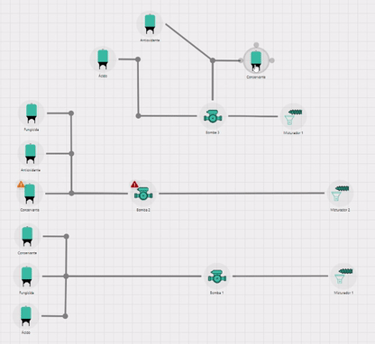

#### Prova de Conceito react-diagram

- Esta Prova de Conceito utliza a biblioteca react-diagram em conjunto com React JS e Typescript para criar um ambiente de manipulação de Diagrama

##### Links de referência

- Códigos de demonstração: `https://github.com/projectstorm/react-diagrams/tree/master/diagrams-demo-gallery/demos`
- Página de demonstração: `http://projectstorm.cloud/react-diagrams/?path=/story/simple-usage--demo-simple`

##### Rodar projeto

- npm i
- npm start

### Preview do Diagrama

##### Checklist de funcionalidades do react-diagram que foram testadas

- [x] Adicionar componentes
- [x] Remover componentes
- [x] Drag and drop de componentes
- [x] Nomear componentes
- [x] Ligação entre componentes
- [x] Ter componente em formato de ícone
- [x] Visualização somente leitura
- [x] Atualizar informações em tempo real
- [x] Salvar no navegador
- [x] Carregar diagrama salvo no navegador
- [x] Customização de componentes
